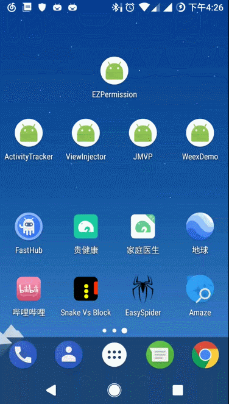

## READ ME ##

　　简单的动态权限处理，使用了Kotlin语言

## 效果 ##

## 使用 ##

### 引入到工程 ###

#### Step 1. Add the JitPack repository to your build file

Add it in your root build.gradle at the end of repositories:

	allprojects {
		repositories {
			...
			maven { url 'https://jitpack.io' }
		}
	}

#### Step 2. Add the dependency ####

	dependencies {
    	compile 'com.github.jianyuyouhun:ezpermission:1.5.2'
	}

### 初始化项目 ###

### 1、在Application中初始化本框架 ####

#### in java

	EZPermission.Companion.init(application);

#### in kotlin

	EZPermission.init(application)

### 2、使用EZPermission申请权限 ###

#### in java ####

	EZPermission.Companion.getInstance().requestPermission(this, new PRequester(Manifest.permission.CALL_PHONE), new OnRequestPermissionResultListener() {
            @Override
            public void onRequestSuccess(@NonNull String permission) {
                Toast.makeText(MainActivity.this, "请求成功" + permission, Toast.LENGTH_SHORT).show();
            }

            @Override
            public void onRequestFailed(@NonNull String permission) {
                Toast.makeText(MainActivity.this, "请求失败" + permission, Toast.LENGTH_SHORT).show();
            }
        });

#### in kotlin ####

       EZPermission.instance.requestPermission(
                this,
                PRequester(Manifest.permission.WRITE_EXTERNAL_STORAGE)
                        .setMessage("该应用需要获取你的存储权限，请到设置页面开启")
                        .setNegativeButtonText("我知道了")
                        .setPositiveButtonText(null),
                onSuccess = { permission ->
                    Toast.makeText(this, "请求成功" + permission, Toast.LENGTH_SHORT).show()
                },
                onFailed = { permission ->
                    Toast.makeText(this, "请求失败" + permission, Toast.LENGTH_SHORT).show()
                })

### 3、注意事项 ###

PRequester的初始化使用链式调用方式如下：

	new PRequester(Manifest.permission.CALL_PHONE)
                .setTips("提示")
                .setMessage("该应用需要获取你的电话权限，请到设置页面开启")
                .setNegativeButtonText("取消")
                .setPositiveButtonText("带我去")

如果不想跳转到设置页面，那么`setPositiveButtonText(null)`即可。消极按钮点击后会关闭对话框并调用`onRequestFailed`回调函数
